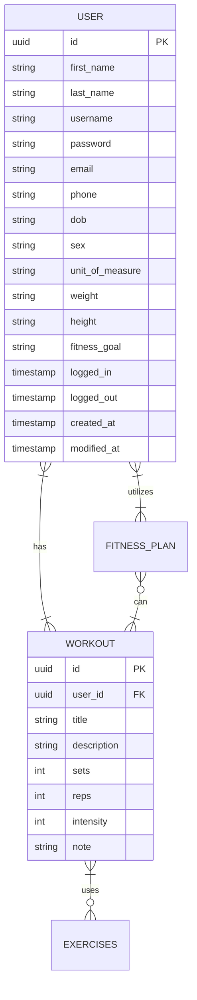

# ERD

```mermaid 
erDiagram
    USER }|--|{ FITNESS_PLAN : utilizes
    USER }|--|{ WORKOUT : has
    USER {
        uuid id PK
        string first_name
        string last_name
        string username
        string password
        string email
        string phone
        string dob
        string sex
        string unit_of_measure
        string weight
        string height
        string fitness_goal
        timestamp logged_in
        timestamp logged_out
        timestamp created_at
        timestamp modified_at
    }
    WORKOUT }|--o{ EXERCISES : uses
    WORKOUT {
        uuid id PK
        uuid user_id FK
        string title
        string description
        int sets
        int reps
        int intensity
        string note
    }
    FITNESS_PLAN }o--|{ WORKOUT : can
```